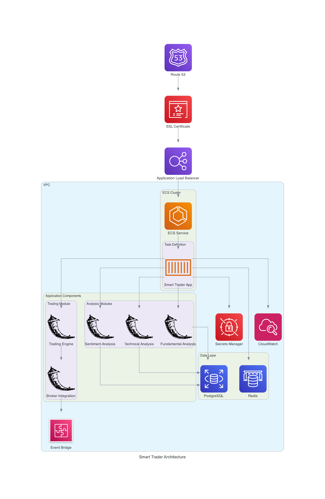

# Smart Trader

An AI-powered trading application for Indian stock markets with advanced market analysis and automated trading capabilities.

## Architecture



The application is deployed on AWS with the following components:

### Network Layer
- **VPC** with public and private subnets across multiple availability zones
- **Application Load Balancer** for traffic distribution
- **Route 53** for DNS management
- **ACM** for SSL/TLS certificates

### Compute Layer
- **ECS Fargate** for running containerized applications
- Auto-scaling based on CPU and memory utilization
- Task definitions with environment-specific configurations

### Data Layer
- **RDS PostgreSQL** for persistent storage
- **ElastiCache Redis** for session management and caching
- Multi-AZ deployment for high availability

### Security
- **Secrets Manager** for sensitive credentials
- Security groups for network access control
- Private subnets for application and database
- SSL/TLS encryption for data in transit
- Database encryption at rest

### Monitoring & Logging
- **CloudWatch** for logs and metrics
- Container insights enabled
- Custom metrics and alarms
- Performance monitoring

## Application Components

### Analysis Modules
1. **Sentiment Analysis**
   - Integrates News API and Twitter API
   - Generates sentiment scores for stocks

2. **Technical Analysis**
   - Implements candlestick pattern recognition
   - Calculates technical indicators (RSI, MACD)
   - Identifies support and resistance levels

3. **Fundamental Analysis**
   - Retrieves financial metrics
   - Analyzes company financials
   - Calculates key ratios

### Trading Module
- Angel Broking SmartAPI integration
- Real-time order execution
- Portfolio management
- Risk management

## Development Setup

1. Create and activate virtual environment:
```bash
python -m venv venv
source venv/bin/activate  # On Windows: venv\Scripts\activate
```

2. Install dependencies:
```bash
pip install -r requirements.txt
pip install -r requirements-dev.txt
```

3. Set up environment variables:
```bash
cp .env.example .env
# Edit .env with your credentials
```

4. Run tests:
```bash
pytest
```

## Deployment

### Prerequisites
- AWS CLI configured
- AWS CDK CLI installed
- Docker installed

### Infrastructure Deployment
1. Install CDK dependencies:
```bash
cd cdk
pip install -r requirements.txt
```

2. Deploy the stack:
```bash
cdk deploy
```

### Application Deployment
The application is automatically deployed through GitHub Actions CI/CD pipeline:
- Push to main branch deploys to staging
- Creating a release deploys to production

## Monitoring

### Available Metrics
- Application performance
- Trading operations
- System health
- Security events

### Logging
- Application logs in CloudWatch
- Access logs from ALB
- Database performance insights

## Security

### Authentication
- API key authentication for external services
- JWT tokens for user sessions
- TOTP for broker authentication

### Data Protection
- All sensitive data in Secrets Manager
- SSL/TLS encryption
- Network isolation
- Regular security audits

## Contributing

1. Fork the repository
2. Create your feature branch
3. Run tests and linting
4. Submit a pull request

## License

This project is licensed under the MIT License - see the LICENSE file for details.
